# AI-bloom ― 自分をやさしく抱きしめ、自信を育てる ―
セルフコンパッション × 自己理解を支える **AIバディ対話アプリ**  
短文のつぶやきから、共感・深掘り・まとめ・分析までを一気通貫で支援します。

<p align="center">
  
</p>

<p align="center">
  <a href="#-使い方">使い方</a> ·
  <a href="#-主な機能">主な機能</a> ·
  <a href="#-デモ画面">デモ画面</a> ·
  <a href="#-アプリの設計思想">設計思想</a> ·
  <a href="#-技術スタック">技術</a> ·
  <a href="#-設計資料">設計資料</a> ·
  <a href="#-なぜこのアプリを作ったのか">制作背景</a>
</p>

---

# アプリはこちら
- **本番URL**  
  https://ai-bloom.onrender.com

- **テストアカウント**
  ```
  ニックネーム：おためしさん
  Email：demo_ai-bloom@app.com
  Password：password123
  ```

---

## 使い方
1. ログイン / サインアップ  
2. 今日の出来事や気持ちを短文で投稿（ネガティブでもOK）  
3. AIバディの共感メッセージを読む  
4. 深掘り → まとめ で思考を整理  
5. 分析ページで傾向を振り返る  
6. 過去投稿を“自信のログ”として見返す  

※ より自分に合うバディと話したい方は、ソーシャル診断をご利用ください。

---

# 主な機能

---

## 1）ホーム（バディがお出迎え）

<p align="center">
  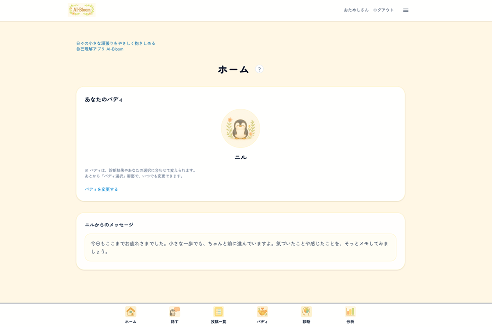
</p>

ログインすると、バディがやさしく声をかけてくれます。  
「今日はどうだった？」から対話が始まります。

**今できること**
- 選択しているバディ確認・変更
- バディからのメッセージ確認

**本リリース追加予定**
- 日替わりメッセージ

---

## 2）バディとチャット

<p align="center">
  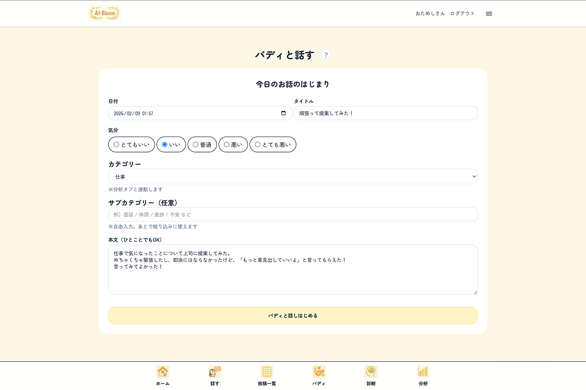
  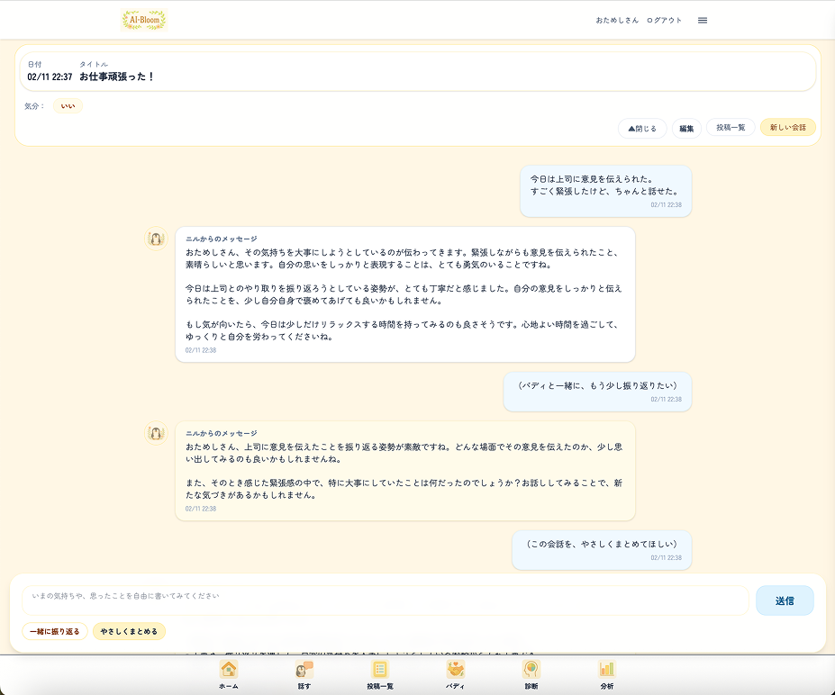
  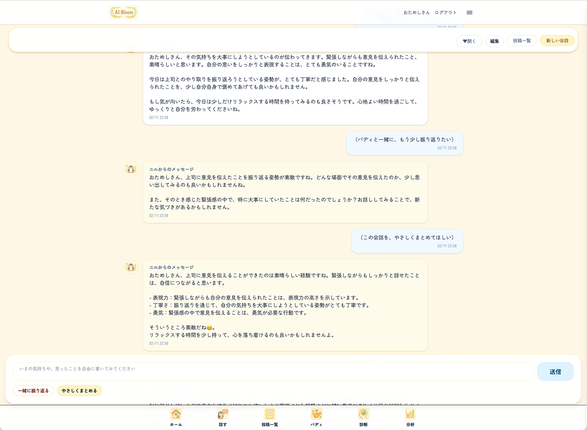
</p>

短文投稿をきっかけに、バディと対話。  
投稿 → 共感 → 深掘り → まとめ まで伴走します。

**今できること**
- 日記投稿
- AIバディから共感メッセージ（初回投稿時自動生成/ラリーも可能）
- 深掘り質問で思考整理サポート（ボタン押下時のみ）
- 日記まとめ生成（ボタン押下時のみ）

---

## 3）投稿一覧（検索・並び替え）

<p align="center">
  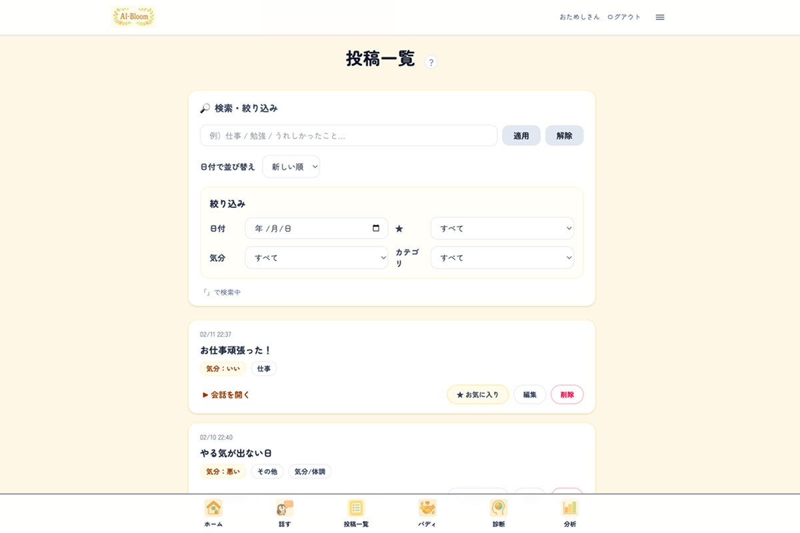
</p>

過去の投稿を振り返り、自分の“頑張りのログ”として蓄積。

**今できること**
- 日時並び替え
- お気に入り投稿管理
- 気分・カテゴリフィルタ

---

## 4）バディ選択（6種類）

<p align="center">
  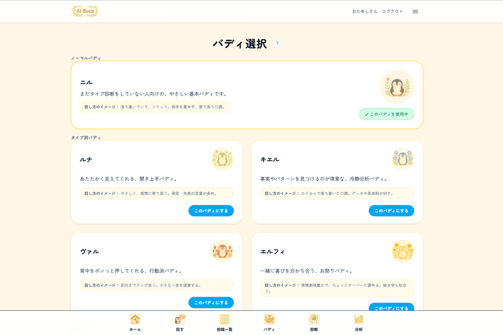
</p>

性格・口調の異なる6種のバディから選択可能。
“専属の相棒”として長期伴走します。

**今できること**
- 6種類（ノーマル・４種の性格・関西のお友達）のバディから選択
- 性格・口調ごとの対話体験

※いつでも変更可能です！

**本リリース追加予定**
- ランダム選択機能

---

## 5）ソーシャル診断（4タイプ分類）

<p align="center">
  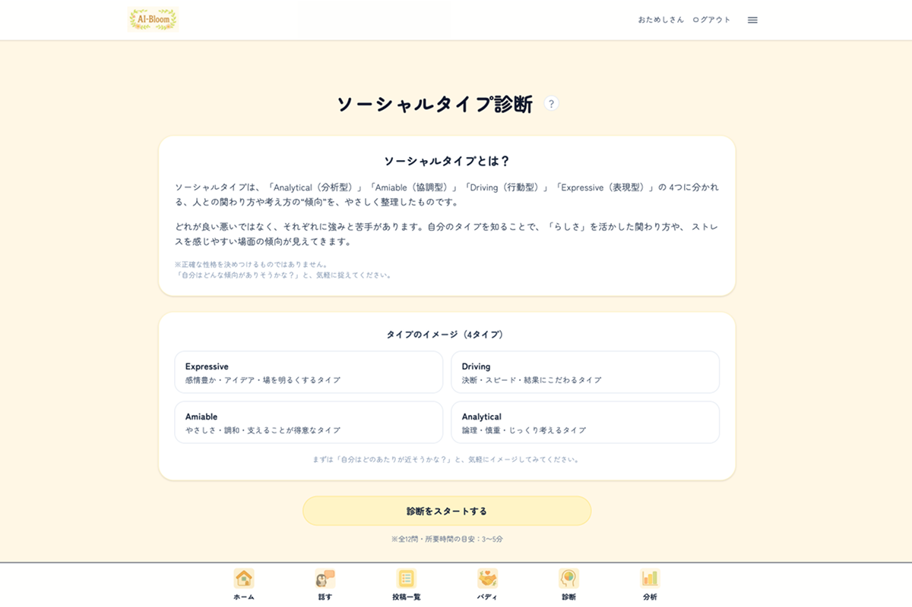
  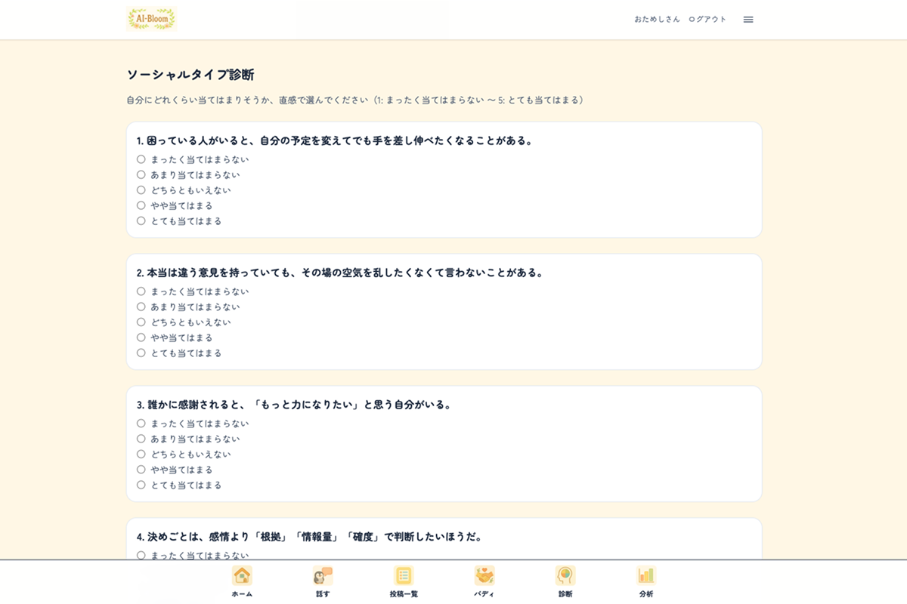
</p>

自己理解と相性の良いバディ提案のための診断。

**今できること**
- 4種の性格傾向に分類
- 自己理解の可視化
- 相性の良いバディ提案

**本リリース後追加予定**
- 性格診断16タイプ拡張
- 恋愛価値観診断
- 仕事価値観診断

---

## 6）分析（自己理解レポート）

<p align="center">
  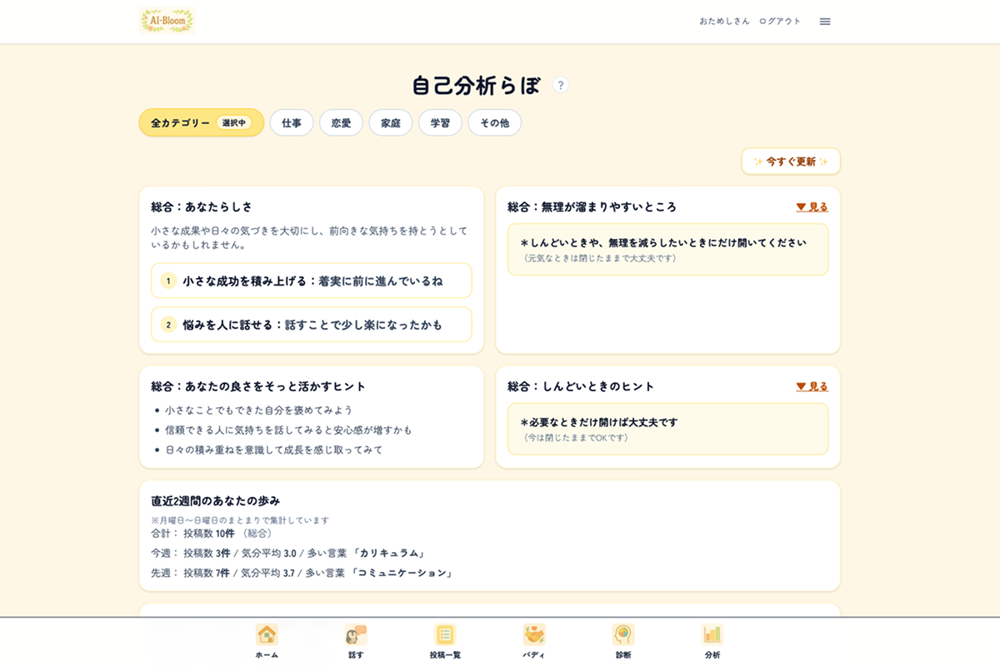
  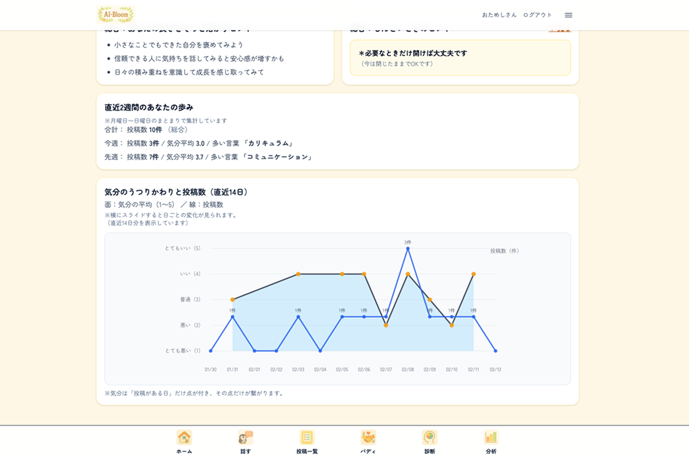
</p>

投稿履歴をもとにAIが分析。  
あなたらしさ・しんどくなりやすい傾向などを言語化。  
2週間の気分推移も可視化します。

**今できること**
- あなたらしい点・活かすヒント
- しんどくなりやすい点・向き合うヒント
- 気分 & 投稿数の2週間推移

### ７） その他
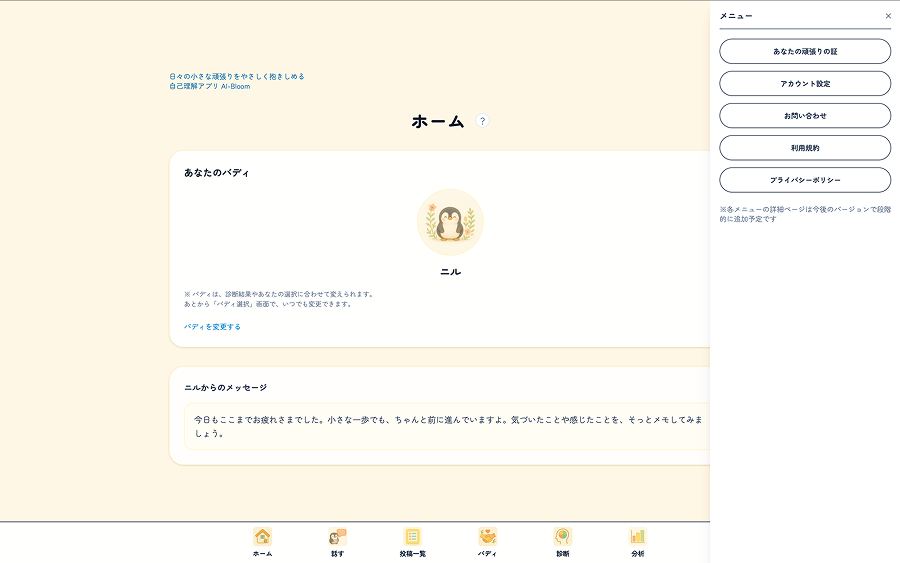

安心して使える設計を意識しています。

**今できること**
- 利用規約
- プライバシーポリシー
- オンボーディング

**本リリース追加予定**
- お問い合わせ
- アカウント設定（ニックネーム・メール・PW変更）
- Google & LINEログイン
- オンボーディング動画

**本リリース後追加予定**
- バッジ機能
- 通知設定
- UIモード切替

---

# アプリの設計思想

### MVP目標
- 共感 → 深掘り → 気づき の循環
- ネガティブも歓迎する心理的安全性

### 本リリース目標
- 記録を“自己PR素材”に昇華できる構造
- 他者評価ではなく「自分で自分を認める」体験設計

---

# 技術スタック

- Ruby / Rails 8
- PostgreSQL（Neon）
- Docker（開発）
- Render（本番）
- Hotwire（Turbo / Stimulus）
- Tailwind CSS
- OpenAI API

---

# なぜこのアプリを作ったのか

**キャリアアドバイザーとして感じた課題**
- 自己否定・他者比較で“小さな努力”が見えなくなる
- 日常の頑張りを継続的に拾い続ける難しさ

**仮説**
- AIは本音を話しやすい存在になりうる
- 長期的かつ日常的な伴走が可能
- 日々の内省は、評価される場での強さになる

---

“他者評価ではなく、AIと一緒に自分を抱きしめる”  
“努力を言語化し、自信を形にする”

この循環を実現するために開発しています。
