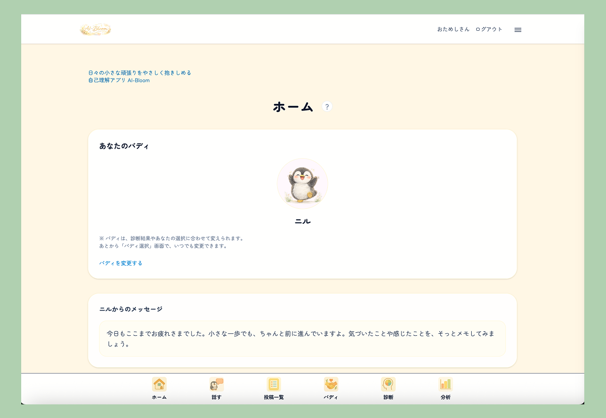
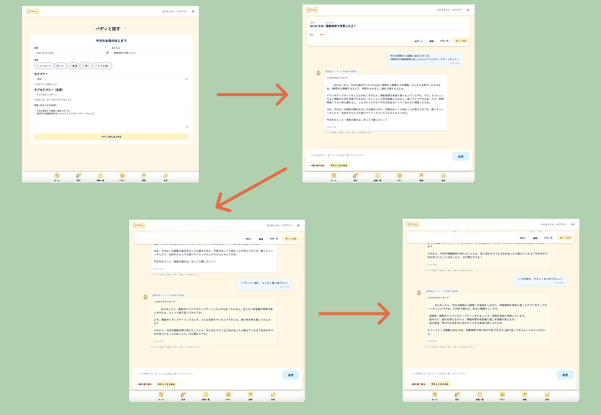
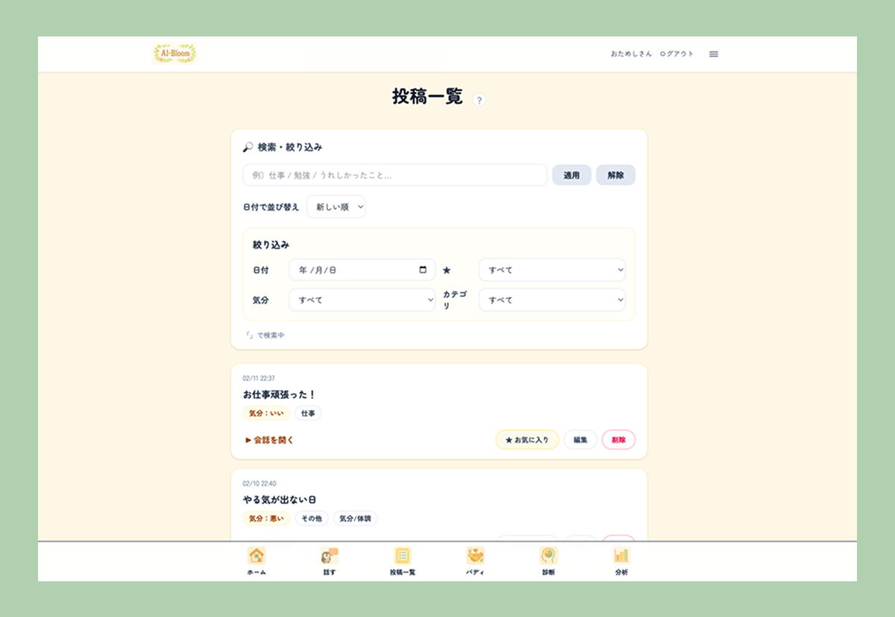
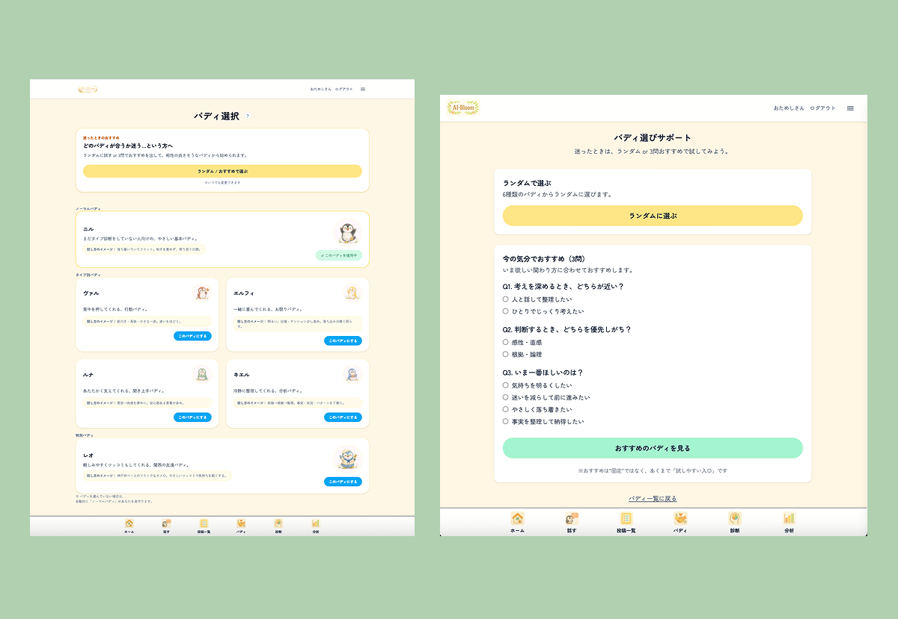
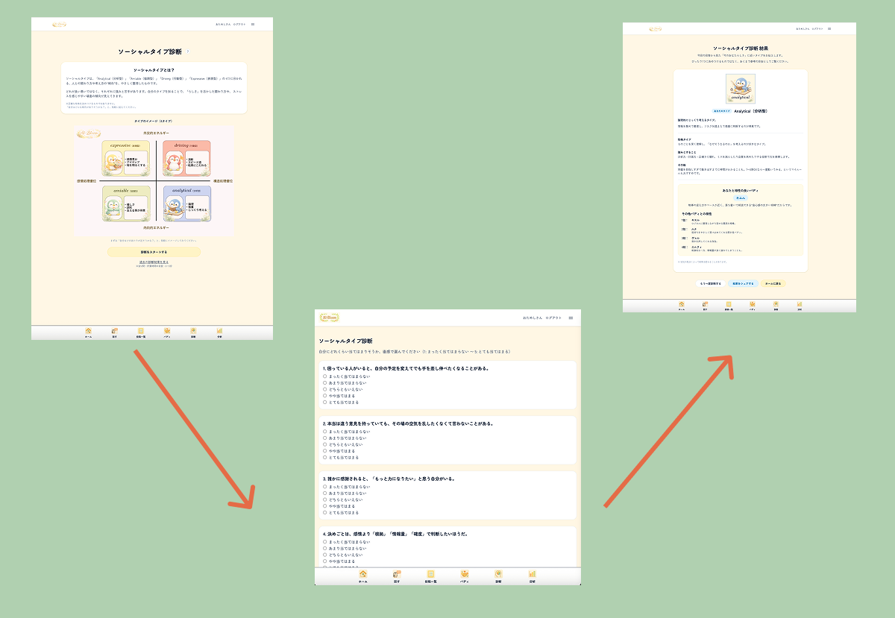
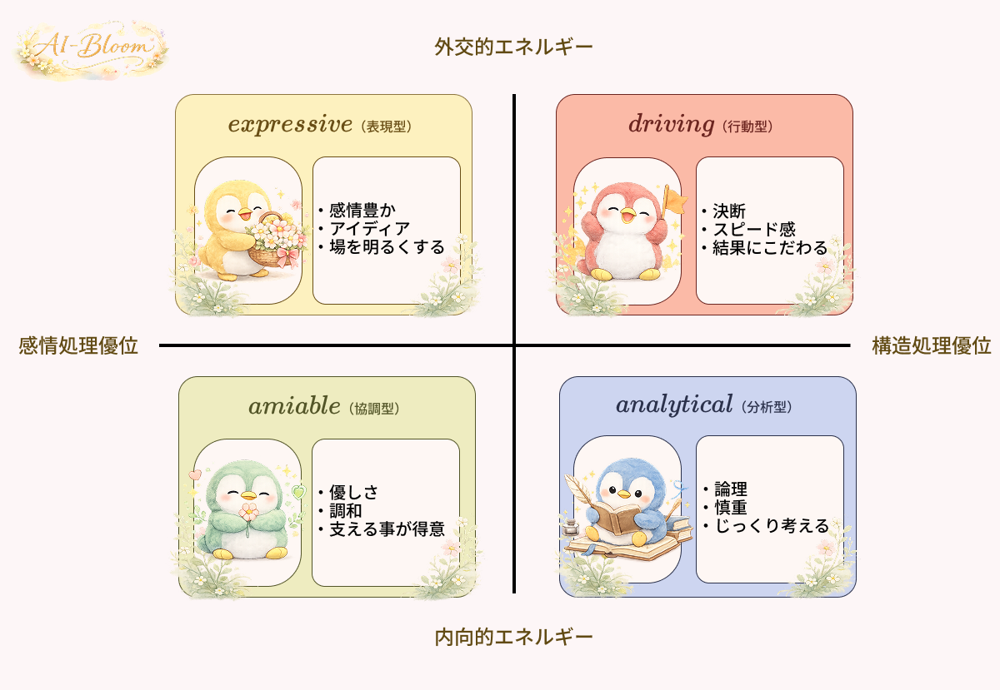
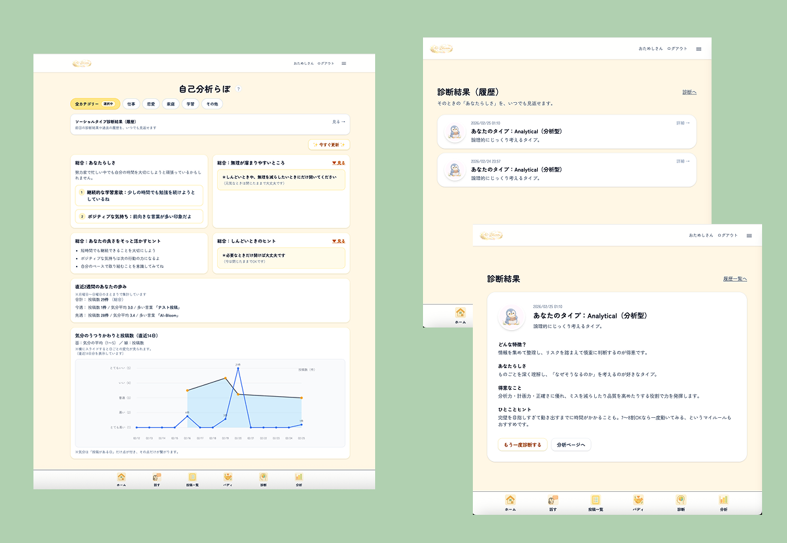
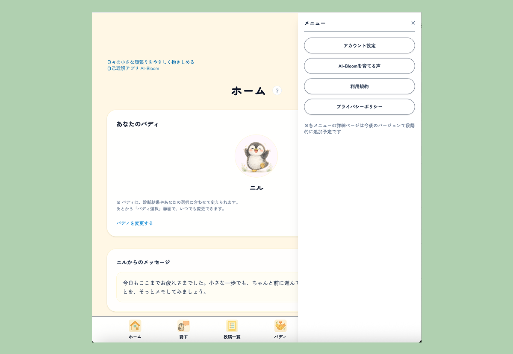

# AI-bloom  
## 行動ログ × 認知傾向 × 主観データを構造化する対話型分析プロダクト

セルフコンパッション × 自己理解を支える **AIバディ対話アプリ**  
単なる日記ではなく、主観的経験を“再解釈可能な構造”へ変換するプロダクトです。

  

  <a href="#-アプリurl">アプリURL</a> ·
  <a href="#-解決したい課題">解決したい課題</a> ·
  <a href="#-主な機能">主な機能</a> ·
  <a href="#-設計思想">設計思想</a> ·
  <a href="#-分析設計">分析設計</a> ·
  <a href="#-技術スタック">技術スタック</a>

---

# アプリURL

**本番環境**  
https://ai-bloom.jp  

**テストアカウント**
ニックネーム：おためしさん /
Email：demo_ai-bloom@app.com /
Password：password123

---

# 解決したい課題

キャリアアドバイザーとして多くの方と向き合う中で感じた課題：

- 小さな努力が自己否定で消えてしまう  
- 他者評価が自己評価を上書きしてしまう  
- 行動はしているのに、自信に繋がらない  

その原因は、

> 経験が構造化されないまま流れていくこと

にあると考えました。

---

# 仮説

1. 行動ログを蓄積するだけでは足りない  
2. 感情と認知を分離・再解釈できる構造が必要  
3. 伝わり方が合わないと、正しい内容も受け取れない  

---

# プロダクトの本質

AI-bloomは

- 行動（何が起きたか）
- 感情（どう感じたか）
- 認知（どう解釈したか）
- 傾向（どう繰り返しているか）

を扱い、

自己理解を「再現可能な構造」に変換します。

最終目的は、

✔ 自己理解  
✔ 自己受容  
✔ 自信形成  

です。

---

# 主な機能

---

## 1）ホーム（バディがお出迎え）

  

ログインすると、バディがやさしく声をかけてくれます。  
「今日はどうだった？」から対話が始まります。

---

## 2）バディとチャット（共感 → 深掘り → まとめ）

  

短文投稿をきっかけに、

投稿 → 共感 → 深掘り → 要約

まで一気通貫で支援。

- 初回共感メッセージは自動生成
- 深掘り・まとめはボタン押下時のみ生成（コスト制御）
- 同一入力でもバディごとに出力構造が変化

---

## 3）投稿一覧（検索・振り返り）

  

- 並び替え
- お気に入り管理
- 気分・カテゴリフィルタ

“頑張りのログ”を蓄積します。

---

## 4）バディ選択（6種類）

  

性格・口調の異なる6種のバディから選択可能。

- ノーマル
- エミアブル
- エクスプレッシブ
- アナリティカル
- ドライバー
- 関西フレンド

### 迷ったときのサポート機能

- ランダムで選ぶ
- 3問の簡易診断でおすすめ提案

YAMLで紐付け管理しており、将来の16分類拡張に対応可能な設計です。

---

## 5）ソーシャル診断（4タイプ分類）

  

コミュニケーション傾向を可視化する補助機能。

  

---

## 6）分析（自己理解レポート）

  

- ソーシャルタイプ診断結果（履歴）
- あなたらしい点
- あなたらしさを活かすヒント
- しんどくなりやすい傾向
- しんどい時のヒント
- 気分推移（直近14日）

主観データを再構造化し、言語化します。

## 7）その他

  

- アカウント設定（ニックネーム/メールアドレス変更　など）
- AI-Bloomを育てる声（ユーザーの声収集）
- 利用規約
- プライバシーポリシー

---

# 設計思想

AI-bloomは単なる感情アプリではありません。

> 行動 × 認知 × 感情を構造化し、  
> 自己理解を再現可能な形へ変換するシステム

として設計しています。

---

# プロンプト設計

バディはUI差分ではなく、system promptレベルで制御。

- 感情タイプ：受容優先
- ロジカルタイプ：結論 → 構造化
- 行動タイプ：次の一歩提示
- 表現タイプ：再解釈・可能性拡張

同一入力でも出力構造が分岐します。

---

# 分析設計

## 1）データ取得ポリシー
- 投稿任意
- 気分入力任意
- 自然発生データのみ扱う

## 2）正規化設計
- mood enum（0〜4）
- 表示用に1〜5へ変換
- MoodScaleモジュールで抽象化

## 3）集計基準
created_atではなく  
**posted_at（出来事基準）で集計**

## 4）分析期間
直近14日固定（認知負荷回避）

## 5）心理安全設計
- ネガティブ要素はデフォルト非表示
- 深度をユーザーが選択可能

## 6）AI生成制御
- ボタン押下時のみ生成
- TTL制御
- データ不足時は生成停止

UXと運用コストの両立。

---

# 技術スタック

- Ruby / Rails 8
- PostgreSQL（Neon）
- Docker（開発）
- Render（本番）
- Hotwire（Turbo / Stimulus）
- Tailwind CSS
- OpenAI API
- Google Analytics

---

# 最後に

他者評価に依存しない自信は、
経験を構造化し、意味づけし直すことで生まれると考えています。

AI-bloomはそのための仕組みです。
